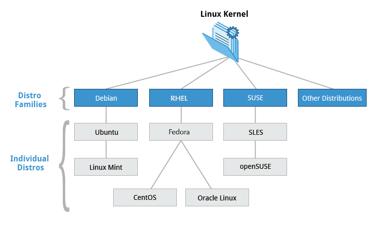

# CHAPTER1 LINUX FOUDATION

## Learning Objectives
- Discuss the role of the Linux Foundation.
- Appreciate the learning opportunities provided by the `Linux Foundation's` training program.
- Describe the software environment required for this course.
- Describe the three major Linux distribution families.

## Table of contents

1. [About Linux Foundation](#About Linux Foundation)
2. [Software environment](#Software environment)
3. [three major Linux distribution families](#three major Linux distribution families)
4. [summary](#summary)

## About Linux Foundation

As a result, the Linux Foundation today hosts far more than Linux; 
it is the umbrella for many critical open source projects that power corporations today, spanning virtually all industry sectors.

The Foundation hosts hundreds of the world's most important open source projects including Linux, Kubernetes, Node.js, Hyperledger, ONAP, Cloud Foundry, Yocto, GraphQL, Jenkins, and many more.

## Software environment

- Red Hat Family Systems (including CentOS and Fedora)
- SUSE Family Systems (including openSUSE)
- Debian Family Systems (including Ubuntu and Linux Mint)

I am using github code space that provide me the Ubunto.

## three major Linux distribution families

1. Red Hat Enterprise Linum (RHEL)

including CentOS, CentOS Stream, Fedora, Oracle Linux

2. SUSE Linux Enterprise Server (SLES)

3. Debian

The Debian distribution is upstream for several other distributions, including Ubuntu.

*Ubuntu has been widely used for cloud deployments.

## summary

- The Linux Foundation is the umbrella organization for many critical open source projects that power corporations, spanning all industry sectors. Its work today extends far beyond Linux, fostering innovation at every layer of the software stack.

- The Linux Foundation training is for the community and by the community. Linux training is distribution-flexible, technically advanced, and created with the leaders of the Linux development community.

- There are three major distribution families within Linux: Red Hat, SUSE and Debian. In this course, we will work with representative members of all of these families throughout.
 