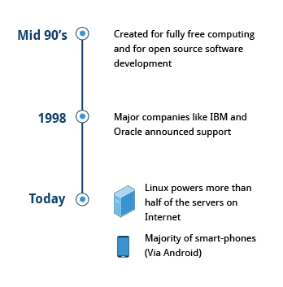
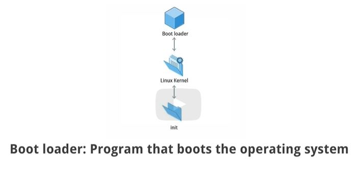
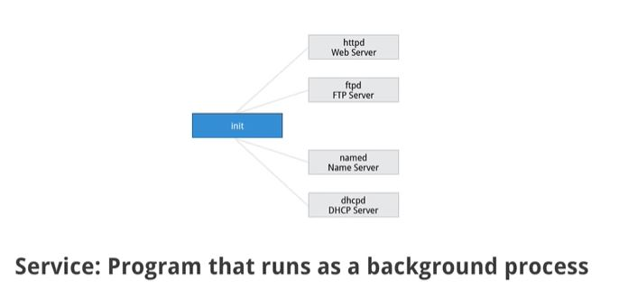
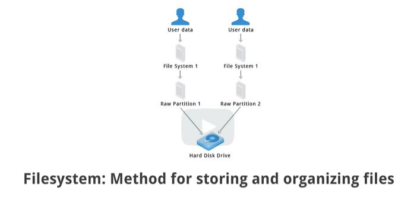
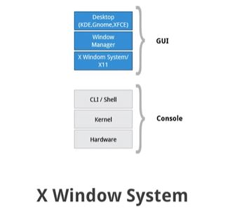
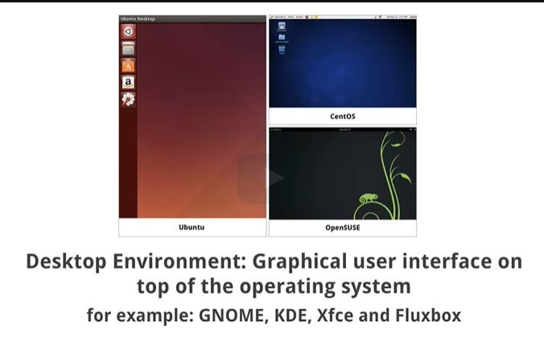

# Linux Philosophy and Concepts

## Learning Objectives
- Discuss the history and philosophy of Linux.
- Describe the Linux community.
- Define the common terms associated with Linux.
- Discuss the components of a Linux distribution.

## table of contents

1. [Linux History](#Linux History)
2. [Linux Philosophy](#Linux Philosophy)
3. [How Linux Is Built](#How Linux Is Built)
4. [Linux Community](#Linux Community)
5. [Linux Terminology](#Linux Terminology)
6. [Linux Distributions](#Linux Distributions)
7. [summary](#summary)

## Linux History

Linux is an open source computer operating system, initially developed on and for Intel x86-based personal computers. It has been subsequently ported to an astoundingly long list of other hardware platforms, from tiny embedded appliances to the world's largest supercomputers.

## Linux Philosophy

Linux is constantly enhanced and maintained by a network of developers from all over the world collaborating over the Internet, with Linus Torvalds at the head. Technical skill, a desire to contribute, and the ability to collaborate with others are the only qualifications for participating.

## How Linux Is Built

Linux is built collaboratively across companies, geographies, and markets resulting in the largest collaborative development project in the history of computing.

## Linux Community

Suppose that, as part of your job, you need to configure a Linux file server, and you run into some difficulties. If you are not able to figure out the answer yourself or get help from a co-worker, the Linux community might just save the day!

## Linux Terminology

When you start exploring Linux, you will soon come across some terms which may be unfamiliar, such as distribution, boot loader, desktop environment, etc. Before we proceed further, let's stop and take a look at some basic terminology used in Linux to help you get up to speed.

### Kernal!

The kernel is considered the brain of the Linux operating system. It controls the hardware and makes the hardware interact with the applications.

[Alt text](images/kernal.JPG)

### Distribution or Distro

A distribution also known as Distros is a collection of programs combined with the Linux kernel to make up a Linux-based operating system.

### Boot loader

The boot loader, as the name implies, is a program that boots the operating system.

### service

A service is a program that runs as a background process.

### File System

A filesystem is a method for storing and organizing files in Linux.

### X Windows System

The X Window System provides the standard toolkit and protocol to build graphical user interfaces on nearly all Linux systems.

### Desktop Environment

The desktop environment is a graphical user interface on top of the operating system.

### Comand line

The command line is an interface for typing commands on top of the operating system.

### Shell

The Shell is the command line interpreter that interprets the command line input and instructs the operating system to perform any necessary tasks and commands. 

For example, bash, tcsh and zsh.

## Linux Distributions

Suppose you have been assigned to a project building a product for a Linux platform. Project requirements include making sure the project works properly on the most widely used Linux distributions. To accomplish this, you need to learn about the different components, services, and configurations associated with each distribution. We are about to look at how you would go about doing exactly that.

## summary

